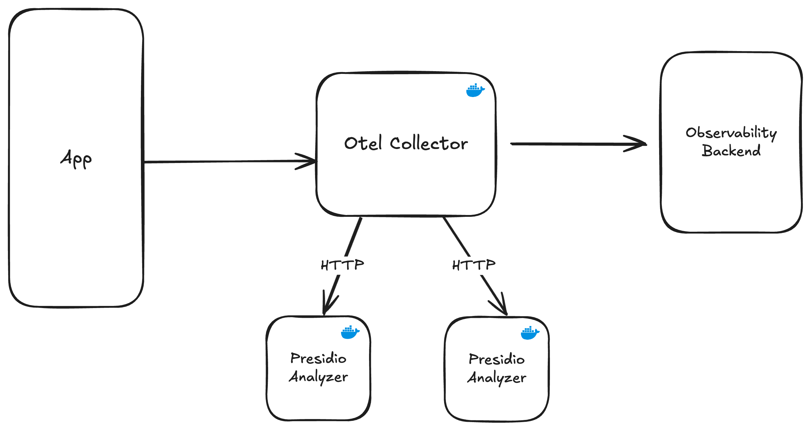
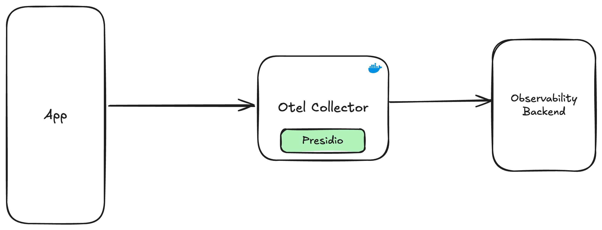

# PresidioRedactionProcessor

[](https://github.com/RKapadia01/PresidioRedactionProcessor/actions/workflows/docker-build-CollectorOnly.yaml)
[](https://github.com/RKapadia01/PresidioRedactionProcessor/actions/workflows/docker-build-CollectorWithPresidio.yaml)

The Presidio Redaction Processor is an OpenTelemetry processor designed to analyze and eliminate Personally Identifiable Information (PII) from OpenTelemetry Logs & Traces.

## Architectural Overview:
The Presidio Redaction processor relies on the capabilities built into [Microsoft Presidio](https://microsoft.github.io/presidio/), an open source tool for identification and anonymization of PII data in text.

The Processor has been built with flexibility in mind, and hence there are 2 deployment options when using this processor.

**Option 1: External Mode**

Deploy the Collector with Presidio, and then deploy separate Presidio Containers into your environment. When running this configuration, the Processor will communicate with the Presidio containers via HTTP to analyze and anonymize instances of PII in your logs & traces.



<u>Pros/Cons of this approach:</u>

| Pros | Cons |
| ---- | ---- |
| The Presidio containers being deployed are maintained and updated regularly by the Open Source maintainers of Presidio      | As the containers are pre-built, there is limited flexibiltiy for adding/altering custom recognizers      |
|| Depending on your environment, communicating with the Presidio Containers via HTTP can add significant overhead|

**Option 2: Embedded Mode**

This code repository contains an implementation of Presidio with a grpc wrapper around it. This allows you to deploy a working instance of Presidio inside the OpenTelemetry Collector, eliminating the need to deploy additional Presidio Containers and make additional HTTP Calls.



<u>Pros/Cons of this approach:</u>

| Pros | Cons |
| ---- | ---- |
|No requirement for external HTTP calls to other containers|As this relies on a custom implementation of Presidio, there is are no maintenance guarantees. The implementation of Presidio is provided as-is, and must be maintained by yourself.|
|PII Data doesn't leave the OpenTelemetry Collector container||
|The custom implementation of Presidio allows you to add additional recognizers to suit your PII detection requirements.||

## Processor Configuration
Please refer to the [schema.yaml](./schema.yaml) for all configuration options.

**Example configuration:**
```yaml
processors:
  presidio_redaction:
    # Specifies whether Presidio is deployed externally to the collector or internally.
    # Refer to the architecture section of this README for more info.
    mode: "embedded"
    # Sets the behaviour of the processor if it encounters an error
    error_mode: "propagate"
    analyzer:
      language: "en"
      score_threshold: 0.5
    anonymizer:
    # Defines how PII gets anonymized when detected
      anonymizers:
        - entity: "default"
          type: "HASH"
          hash_type: "sha256"
   # Utilizes OTTL (OpenTelemetry Transformation Language) to set flags
   # It is recommended to set these flags and pass in attributes indicating
   # which logs/traces you beleive contains PII. This will avoid adding
   # uneccessary overhead to the Otel Pipeline
   process_trace_if:
    - 'attributes["contains_pii"] == true'
   process_log_if:
    - 'resource.attributes["service.name"] == "sample-service" and severity_text == "INFO"'
```

## Deploying the Processor into your environment:
The Presidio Processor is intended to be run inside an [OpenTelemetry Collector](https://opentelemetry.io/docs/collector/).

<u>**If you already have a custom OpenTelemetry Collector deployed into your environment:**</u>

Add the gomod reference to your builder-config:
- `- gomod: github.com/RKapadia01/presidioredactionprocessor/presidioredactionprocessor v0.1.0`
- Populate the `config.yaml` with the relevant configuration. Refer to the [schema.yaml](./schema.yaml) for all configuration options

<u>**Deploying a pre-built collector with the Presidio Redaction Processor:**</u>

This repository contains a set of `Dockerfiles` which provide pre-built and pre-configured OpenTelemtry Collectors that contain the Presidio Redaction Processor.

Firstly, please refer to the [Architectural Overview](#architectural-overview) to understand the deployment options (embedded vs. external).

<u>If running presidio in embedded mode, from the root of the repository, build the Dockerfile:</u>
```bash
docker build . -f CollectorWithPresidio.Dockerfile
```

<u>If running presidio in external mode:</u>
```bash
docker build . -f CollectorOnly.Dockerfile
```
then, pull and run the Presidio Services from MCR:
```bash
docker run --rm -d -p 5002:3000 mcr.microsoft.com/presidio-analyzer:latest
docker run --rm -d -p 5001:3000 mcr.microsoft.com/presidio-anonymizer:latest
```

# Performance Benchmarks
Performance testing on the Presidio Processor has revealed minimal latency impact in both External and Embedded modes.

### Collector -> HTTP * 2 -> Presidio

```
Target URL:          http://localhost:4318/v1/traces
Max requests:        1000
Concurrent clients:  32
Running on cores:    16
Agent:               none

Completed requests:  1000
Total errors:        0
Total time:          7.905 s
Mean latency:        248.8 ms
Effective rps:       127

Percentage of requests served within a certain time
  50%      240 ms
  90%      321 ms
  95%      337 ms
  99%      352 ms
 100%      354 ms (longest request)
```

### Collector -> gRPC -> Presidio

```
Target URL:          http://localhost:4318/v1/traces
Max requests:        1000
Concurrent clients:  32
Running on cores:    16
Agent:               none

Completed requests:  1000
Total errors:        0
Total time:          7.736 s
Mean latency:        242.7 ms
Effective rps:       129

Percentage of requests served within a certain time
  50%      243 ms
  90%      266 ms
  95%      271 ms
  99%      285 ms
 100%      295 ms (longest request)
```
